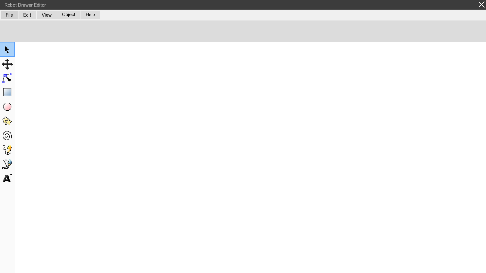
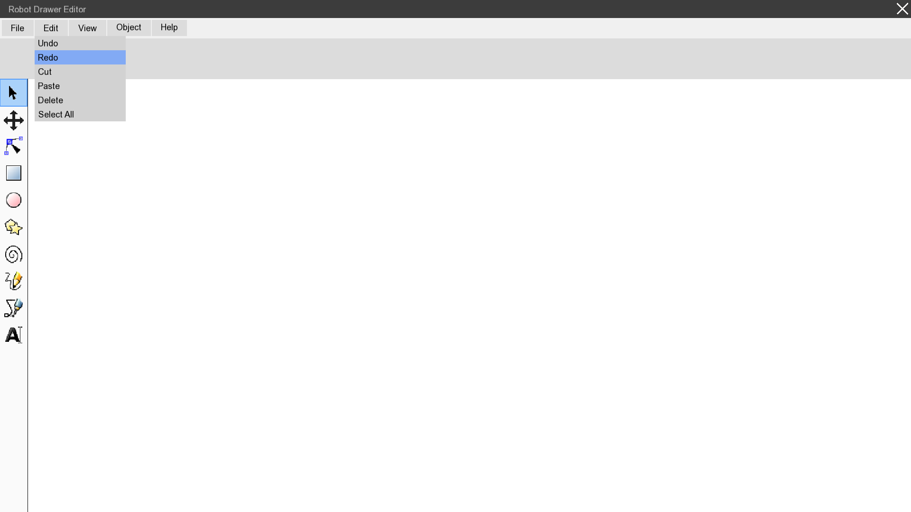

# RobotDrawerEditorCplusplus

A C++ Windows desktop editor made with SFML. This is an old project. After trying SFML with the [Battleships project](https://github.com/TomasZilinek/Battleships) I decided to use the UI created there in some UI-centered project like an editor (still in high school). It was supposed to be a vector graphics editor for my planned Arduino robot arm for drawing (made in 2019)

In the Battleships project I created myself quite a nice little "library" of UI components like labels, buttons... I wanted to continue developing this library and use it in a more serious project. So I programmed more and edited and added TextLabel, ImageLabel, TextButton, ImageButton, TextEntry, DropdownMenu and SelectButtonBar.

After programming all the UI components I was too exhausted. I had a little C++ ptsd and decided to discontinue the project to replenish my sanity. It has the editor layout and the components work but it doesn't do anything. The <b>main highlight</b> of the project are the UI components. They are not used much but they work and the code is nice taking into consideration that I was a noob at that time.

## Install

1. Unzip the SFML file and place the SFML folder in the root.
2. Manually link SFML like in this [video](https://youtu.be/yEiZalvDOj4?si=K4HHl0B0l9rvDUVq)
3. Visual studio with C++ compiler to run (or use your own compiler if you know what you are doing)
   - Make sure to build under x86 and not x64

## Credits

- [Tomáš Žilínek](https://www.linkedin.com/in/tomaszilinek)

